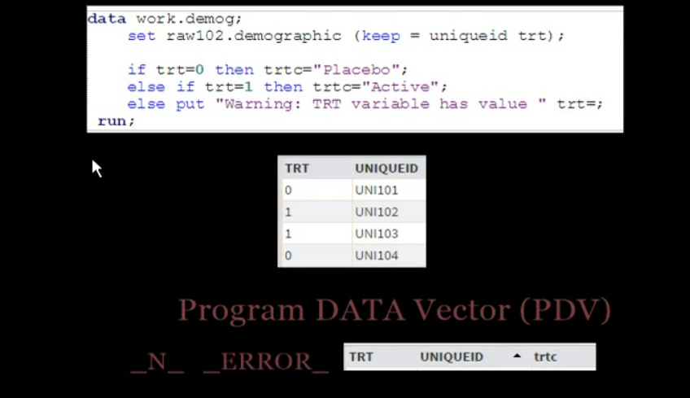

## Selecting Observations - aka. Filtering Rows
* note Difference at "IF Gender" and "If Then" They serve DIFFERENT purpose
* Here only male rows are selected into output dataset (aka Filtering)

```bash
data work.demog;
  set raw102.demographic; 
  
  IF gender = 1;
  
  if trt=0 then trtc = "Placebo";
  else if trt=1 then trtc = "Active";
  else PUT "Warning: TRT variable has different value=" trt= ;
  
  DROP uniqueid dob randdt
run; 
```

## Limiting input-variable by keep and drop OPTIONS
* Note the "keep=" statement is put insame line of "set", this reads ONLY those variables from input-dataset
```bash
data work.demog;
  set raw102.demographic  (keep= uniqueid trt) ; 
  
  if trt=0 then trtc = "Placebo";
  else if trt=1 then trtc = "Active";
  else PUT "Warning: TRT variable has different value=" trt= ;
run;
```



## Compilation & Execution Phase
* During Compilation 3 things happen
  * check syntax, (trtc is derived variable)
  * create PDV (PDV holds one row in memory, as sas processes one row at a time)
  * Create output Metadata (variable label, type, name, format/informat etc.,)
 * During Execution Phase
  * takes one obs to PDV
  * "_N_" = 1, for first row (index)
  * "_ERROR_" will be 0 or 1 based on input error or not
