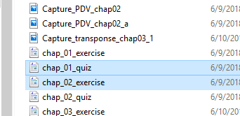

## Summary
We learn about these PROC stmts,

* PROC PRINT - for data
* PROC CONTENTS - for metadata
* PROC SORT
* PROC MEANS
* PROC TRANSPONSE
* PROC REPORT

[Exercise and Quiz Link](https://drive.google.com/open?id=1eTL51tmZouPdxk8Wq2XwSyZ5bz_slpse)

