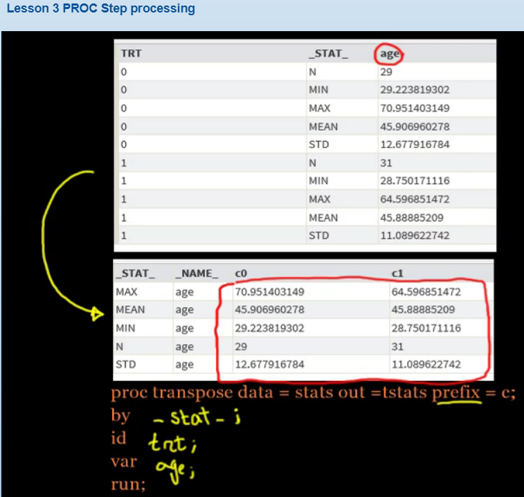

## PROC Transpose (aka Pivot)
* by= keep variables in both in and out DS
* id=trt which is privot-by or group-by where 0 and 1 are changing from row-to-column
* var=age represents teh variable-name of all stat-values
* ! when "by" stmt i sused, make sure those variables are already sorted out , else you get ERROR (below example is _stat_)
* note: append below code to previous-means code



```bash
proc sort data=stats;
by DESCENDING _stat_;
run;

PROC transponse data=stats out=tstats prefix=col_ ;
by DESCENDING _stat_;
id trt;
var age;
run;
```

## PROC report
* Helps to convert DS to a report format for display/printable  needs
* note: append below code to previous-transponse code

```bash
PROC report data=tstats;
columns _stat_ col_0 col_1;

define _stat_ / "Statistics";
define col_0  / "Placebo";
define col_1  / "Active";

run;
```

